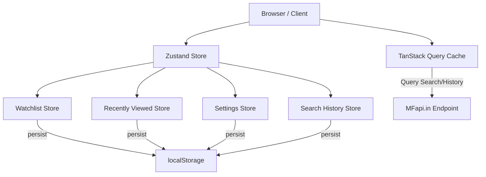

# Architecture & Design Document - MF Tracker

## Directory Structure

```text
src/
├── app/              # Router, Provider setup
├── components/       # UI elements
│   ├── ui/           # Radix, Skeleton, Error boundary wrappers
│   ├── charts/       # Recharts Area/Line configurations
│   ├── fund/         # FundCard, performance indicators
│   └── layout/       # Sticky Header, Footer wrappers
├── pages/            # Home, Search, Detail, Compare, SIP, Watchlist, Settings
├── hooks/            # useTheme, useMFApi, useDebounce
├── services/         # mfapi.ts (API fetch call helpers with backoff retry)
├── store/            # Zustand local state management slices
├── layouts/          # MainLayout view structure
├── utils/            # formatters, math formulas, CSV/PNG exporters
├── types/            # TypeScript interfaces definitions
└── styles/           # CSS design tokens & global overrides
```

---

## State Flow Diagram



---

## Technical Highlights

### 1. Robust API Retries
MFapi.in is a free community API that occasionally experiences minor downtime or high latency. The service layer (`src/services/mfapi.ts`) implements a `fetchWithRetry` wrapper with **exponential backoff** (up to 3 retries, starting with 500ms delay) to prevent interface crashes.

### 2. Normalized Comparison Data
Different mutual funds have widely varying NAV price scales (e.g. one fund at ₹25 and another at ₹1,200). 
The comparison chart (`src/pages/Compare/index.tsx`) aligns multiple NAV history timelines and normalizes values to **0% starting returns** based on the first data point in the selected period. This allows users to accurately compare relative growth rates side-by-side.

### 3. PWA Offline Cache
`vite-plugin-pwa` is configured with a custom Workbox caching rule targeting `api.mfapi.in` endpoints. It uses a **NetworkFirst** caching strategy with a cache duration of 5 minutes. If a user loses internet connectivity, they can still view recently loaded charts and details without interruption.
